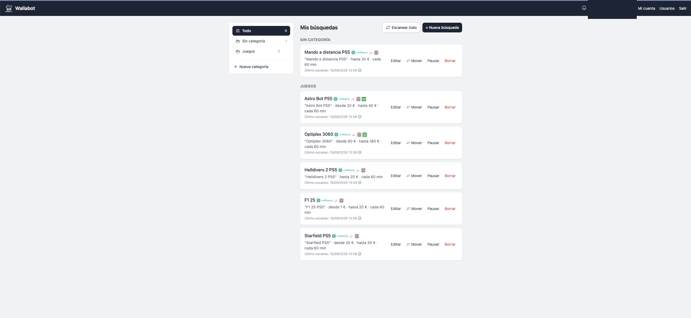
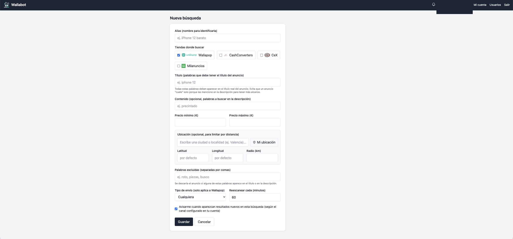
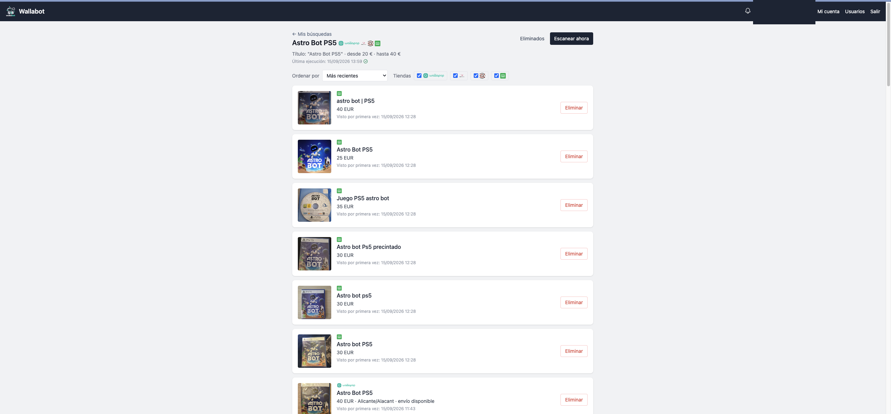
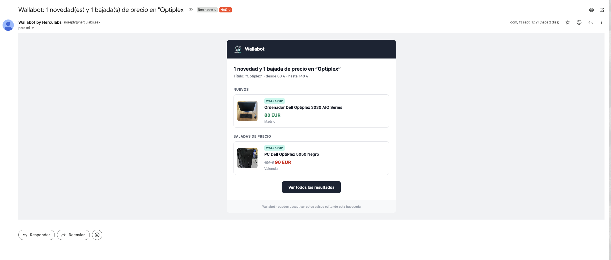
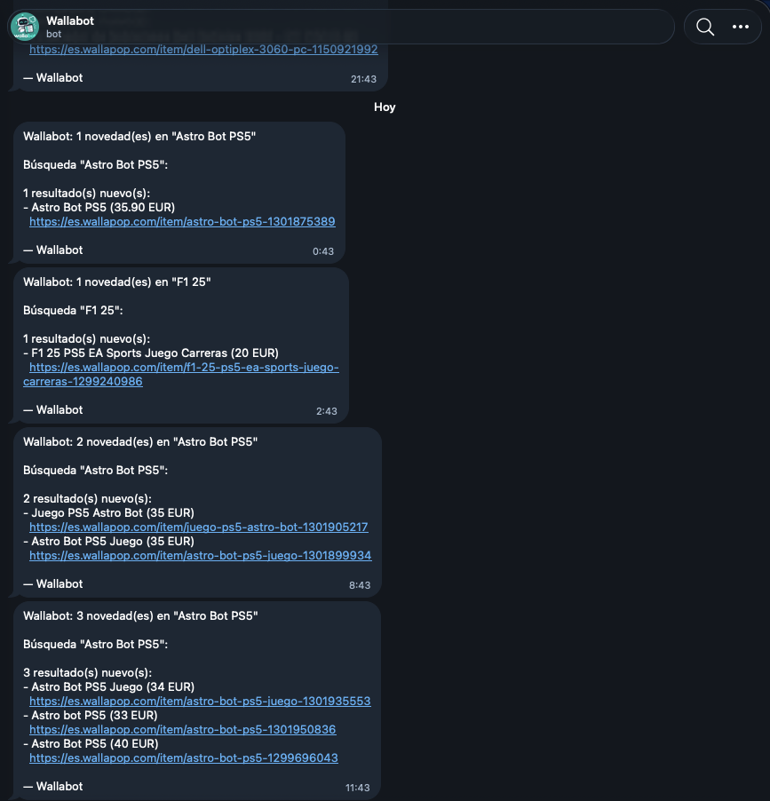

# Wallabot

[](LICENSE)
[](https://github.com/0herculabs/wallabot/commits)
[](https://github.com/0herculabs/wallabot/commits)

Bot con interfaz web para búsqueda y monitorización de productos de segunda mano en
**Wallapop, Milanuncios, CEX y Cash Converters**. Define búsquedas por producto y rango de
precio, y Wallabot las reescanea periódicamente avisándote solo de lo nuevo (o de bajadas de
precio), sin repetirte anuncios ya vistos ni los que ya has descartado.



> ⚠️ **IPs de datacenter/VPS**: muchos proveedores de VPS y nube (AWS, DigitalOcean, Hetzner,
> OVH, etc.) tienen sus rangos de IP bloqueados o marcados como sospechosos por estas
> plataformas, así que el escaneo puede fallar, devolver resultados vacíos o dar errores si
> despliegas Wallabot ahí. Se recomienda ejecutarlo desde una conexión residencial (tu propia
> casa, un NAS, una Raspberry Pi, un LXC en tu red doméstica) o, si lo alojas en la nube, usar un
> proxy residencial para las peticiones salientes. El bot no trae soporte de proxy integrado por
> ahora.

## Despliegue paso a paso en Ubuntu

Tutorial completo para levantar Wallabot en una máquina Linux limpia (Ubuntu 22.04/24.04),
por SSH.

1. Conéctate a la máquina y actualiza paquetes:

   ```bash
   ssh usuario@tu-servidor
   sudo apt update && sudo apt upgrade -y
   ```

2. Instala Docker y Docker Compose (paquetes oficiales de Ubuntu):

   ```bash
   sudo apt install -y docker.io docker-compose-v2 git
   sudo systemctl enable --now docker
   ```

   Opcional, para no tener que usar `sudo` en cada comando de Docker (hace falta cerrar
   sesión y volver a entrar para que se aplique):

   ```bash
   sudo usermod -aG docker $USER
   ```

3. Clona el repositorio:

   ```bash
   git clone https://github.com/0herculabs/wallabot.git
   cd wallabot
   ```

4. Configura el entorno:

   ```bash
   cp .env.example .env
   nano .env   # ajusta PORT, coordenadas por defecto, admin, notificaciones...
   ```

5. Levanta el contenedor:

   ```bash
   docker compose up -d --build
   ```

6. Comprueba que responde (cambia el puerto si no usaste el 12185 por defecto):

   ```bash
   curl -I http://localhost:12185/login
   ```

7. Accede desde tu navegador a `http://IP-DE-TU-SERVIDOR:12185` e inicia sesión (con el
   `ADMIN_USERNAME`/`ADMIN_PASSWORD` que hayas puesto en `.env`, o el que hayas creado a mano
   con `docker compose exec wallabot python -m wallabot.cli create-admin ...`).

**Importante — no lo expongas directamente a internet.** Wallabot no está pensado para eso: no
hay HTTPS ni límite de intentos de login incorporado. Para acceder desde fuera de tu red local,
usa una VPN como [Tailscale](https://tailscale.com/) o similar, o pon un proxy inverso (Caddy,
Nginx) delante con HTTPS y lo dejas accesible solo dentro de esa red privada. Si necesitas abrir
el puerto en el firewall de la propia máquina para tu red local/VPN:

```bash
sudo ufw allow 12185/tcp
```

Para actualizar a una versión nueva más adelante:

```bash
cd wallabot
git pull
docker compose up -d --build
```

### Variables de entorno y volúmenes

Variables editables en `.env` (ver `.env.example` para la lista completa con su valor por
defecto): `PORT`, `SECRET_KEY`, `DEFAULT_LATITUDE`/`DEFAULT_LONGITUDE`, `TIMEZONE`,
`ADMIN_USERNAME`/`ADMIN_PASSWORD`/`ADMIN_EMAIL`, `SMTP_*`, `TELEGRAM_BOT_TOKEN`,
`PUBLIC_BASE_URL`.

El volumen `wallabot-data` se monta en `/data` dentro del contenedor y ahí se guardan la base de
datos SQLite y la `SECRET_KEY` autogenerada; persiste entre `docker compose down` y
reconstrucciones de la imagen.

### Notificaciones por Telegram (opcional)

1. Abre una conversación con [@BotFather](https://t.me/BotFather) en Telegram.
2. Envía `/newbot` y sigue sus instrucciones: te pedirá un nombre para mostrar y un
   nombre de usuario (debe terminar en `bot`, ej. `wallabot_tuinstancia_bot`).
3. Al terminar, BotFather te da un token con forma
   `123456789:ABCdefGhIJKlmnoPQRstuVWXyz`. Pégalo en `TELEGRAM_BOT_TOKEN` dentro de tu `.env`
   y reinicia el contenedor (`docker compose up -d --build`).
4. Este bot es único para todo el servidor: cada usuario, ya desde la web (`Cuenta` →
   `Telegram`), obtiene su propio `chat_id` hablando con el bot y con
   [@userinfobot](https://t.me/userinfobot), y lo guarda ahí para activar sus avisos.

## Capturas

| Nueva búsqueda | Resultados |
| --- | --- |
|  |  |

| Aviso por email | Aviso por Telegram |
| --- | --- |
|  |  |

## Notas

- Base de datos SQLite, sin servicio de BD separado.
- El scheduler (APScheduler) vive dentro del propio proceso; no hace falta cron ni tareas
  externas.
- Las notificaciones por email/Telegram son opcionales, vía las variables `SMTP_*` /
  `TELEGRAM_BOT_TOKEN`; cada búsqueda tiene su propio interruptor de aviso.

## Aviso legal

Wallabot es un proyecto independiente y no tiene afiliación, patrocinio, autorización ni
relación oficial de ningún tipo con Wallapop, Milanuncios, CEX ni Cash Converters. Los nombres,
marcas y logotipos de estas plataformas pertenecen a sus respectivos titulares y se muestran
aquí únicamente para identificar el origen de cada resultado, sin ánimo de asociación ni de
inducir a confusión sobre su procedencia.

Wallabot no elude ningún mecanismo de autenticación, control de acceso, CAPTCHA ni medida de
protección técnica: únicamente consulta, mediante peticiones HTTP estándar (las mismas que haría
un navegador), información de anuncios que las propias plataformas publican abiertamente para
cualquier visitante. No accede a cuentas de usuario, datos privados ni áreas restringidas.

El software se distribuye "tal cual" y sin garantía de ningún tipo bajo licencia MIT (ver
[`LICENSE`](LICENSE)); el autor no es responsable de los daños derivados de su uso.

El acceso automatizado a estas plataformas puede estar sujeto a sus propios Términos de
Servicio, que pueden cambiar y que Wallabot no garantiza que cumplas en tu caso concreto.
**Quien despliegue y use este proyecto lo hace bajo su exclusiva responsabilidad, y asume en
solitario cualquier consecuencia —incluidas reclamaciones de terceros— derivada de ese uso; el
autor queda expresamente exonerado de responsabilidad frente a cualquier reclamación de este
tipo.** Si alguna de estas plataformas solicitase la retirada o modificación de este proyecto,
dicha solicitud se atenderá.
